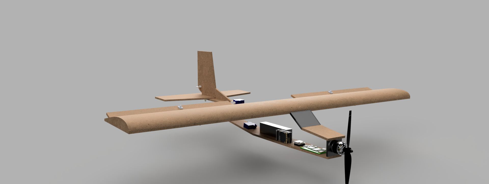

# RC Plane With Advanced Autonomus - Add on to ArduPilot

This project is like the title suggest it is an RC plane full fledged with remote control Ardu pilot as the backbone, but with an addon to assieted navigation and autonomus. Ardupilot offer bare bone navigation but i wanted more like detecting nervous, beginner, lost pilot.  

On top of that I also wanted to make a plane from scratch instead of an amazon RC. My end goal is using the raspberry pi onboard to seend frames and gps signal to a machine on the ground for processing and then using that procssed data to make informed deiscions.  
Like avioding a tree!

---

## Why I Made This?

Becuase i love things that fly i spefcialyl have an odd obession with commerical jets spefcially their engines, i find their engines to be amazing spefcially the internal combustion how air is compressed and thrown back at a high speed! Obiovusly i cant make that at home but i can make a small RC plane that is smart!

---

## 3D Model

Here is an exposed 3d model(the reciver is not visible because the antenna can be removed and be put on directly keeping size and weight limited)

---

## Wiring

Here is the wiring under the hood:

---

## Cost Breakdown

[View CSV](BOM.csv)

---

## Important Notes

I used CAD made by others in this project like the rapberry pi zero 2 made by Tuấn Quang and speedy bee made by Viacheslav Shevchuk. Electonicrs are hard to CAD and so i used the pre-made models. Even though i am not using speedybee and an ATOMrc in the final build the sizes are similar, 
and furthermore it makes it look better rather than having a random gray block floating aroud in the cad!

The BOM is not the most accurate final price it nails the prices of all items but  the final price came out to be 316 dollars, Yes, I realize if i add all of the numbers up 260 from amazon and 50 dollars from AtomRC site, and 6 dollars for the foam that is more than the allocated budget! Amazon is not showing excatly what the tax rate is on every item because i added 10 percent local tax rate to everything, and shipping is free for $35+ items so i don't get it(it does not show anywhere what it is adding and why until i enter my credit card info which I dont have)! 
But here is the thing i am ready to pay that out of pocket if hack club cannot fund the other 16! Please do not reject my submussion because i am over on my budget! These parts will be recycled for the next project, a flight controller can be used for anything! It can be used to make a drone, helictoper or rover(well it depends on the total amperge of the motor what type i am using more servos or outrunner, but that is not the point!). 
I am still thankful reagrdless, for the funding because my parents never in a million year would buy me this stuff, because "it looks like junk."
